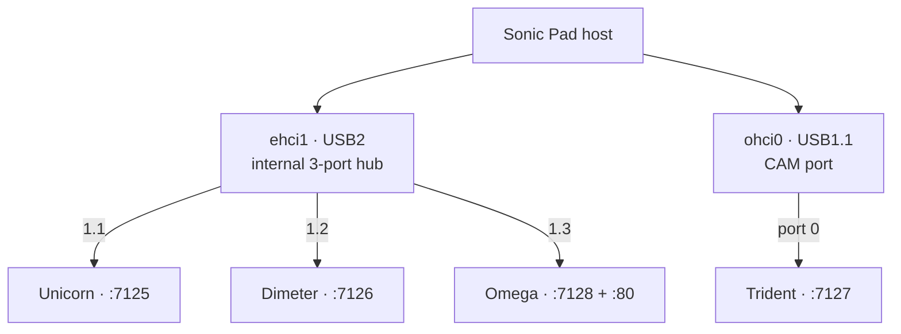
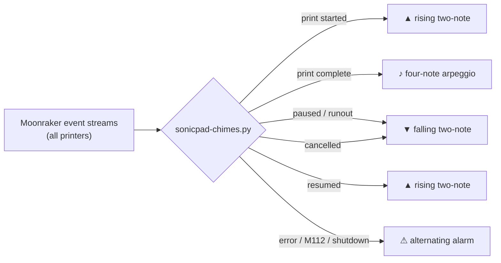
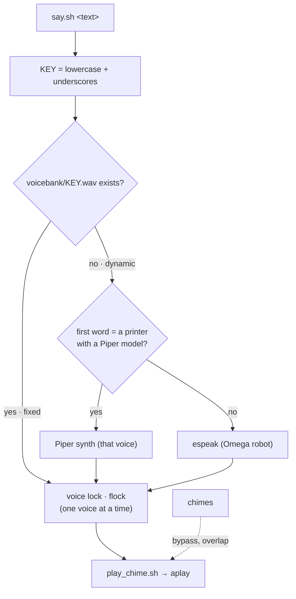

# Turn a dead-end Creality Sonic Pad into a voiced, self-healing print farm

A complete roadmap: wipe the abandoned firmware, run four (or eight) Neptune 3 Pros from one modern portal, tune them properly, back them up automatically — and give the whole rack a voice, lights, and a sense of humor. Every step, every command, what it does, and exactly where to run it.

> Built and battle-tested on a four-printer Elegoo Neptune 3 Pro farm (Omega · Unicorn · Dimeter · Trident), prewired for eight (Tesseract · Pentagram · Sestina · Hydra).

### 📖 How to read this guide

**Where each command runs.** Every command block is tagged:

- **💻 PC · PowerShell** — a PowerShell window on your Windows computer.
- **🖥️ Pad · SSH / bash** — the Linux shell *on the pad*, reached by running `ssh sonic@<pad-ip>` from PowerShell; after that your terminal **is** the pad until you type `exit`.

Every non-obvious command has a short **→ what it does** note beneath it.

**The files use the author's names.** The scripts and `macros.cfg` refer to four printers — `Omega`, `Unicorn`, `Dimeter`, `Trident` — on Moonraker ports `7128`/`7125`/`7126`/`7127` (Omega is also the port-80 default), with 5–8 prewired as `Tesseract 7129`, `Pentagram 7130`, `Sestina 7131`, `Hydra 7132`. **These are placeholders for your machines** — find-and-replace them with your own names/ports across the kit before first use.

## Contents

1. [Why & what you'll have](#1-why-and-what-youll-have)
2. [What you need + companion files](#2-what-you-need--where-to-get-the-files)
3. [Prep & back up](#3-prep--back-up)
4. [Flash the pad (Windows driver prep)](#4-flash-the-pad-to-debian)
5. [First boot & the power button](#5-first-boot--taming-the-power-button)
6. [Install the four-printer stack (KIAUH)](#6-install-the-four-printer-stack-with-kiauh)
7. [Bind printers to ports — CH340](#7-bind-each-printer-to-a-physical-port--the-ch340-trap)
8. [Board firmware](#8-compile--flash-matching-board-firmware)
9. [Restore configs](#9-restore-configs--three-edits-that-matter)
10. [Fluidd & KlipperScreen](#10-fluidd--klipperscreen)
11. [Shared macros, the LED rig & macro reference](#11-one-shared-macro-set--the-led-rig)
12. [Sound, chimes, voice & your own names](#12-sound--the-fix-chimes--the-voice-bank)
13. [The four silly shows](#13-the-four-silly-shows)
14. [Cameras](#14-cameras)
15. [Interactive tools — input shaping & runout reload](#15-interactive-tools--input-shaping--guided-filament-reload)
16. [Automated backups](#16-automated-backups--your-safety-net)
17. [Adding printers 5–8](#17-adding-printers-58)
18. [Tune the fleet](#18-phase-2--tune-the-fleet)
19. [Raspberry Pi / tablet host](#19-on-a-raspberry-pi-or-a-tablet-instead)
20. [Updates & upkeep](#20-updates--upkeep)
21. [Troubleshooting & rollback](#21-troubleshooting--rollback)
22. [All links](#22-all-links)

---

## 1. Why, and what you'll have

Creality abandoned the Sonic Pad in early 2024, leaving it on a locked, heavily-modified fork of an old Klipper. This build replaces Creality's OS with **Debian Linux running mainline Klipper, Moonraker, current Fluidd, and KlipperScreen** — the same stack a Raspberry Pi runs — then layers on the quality-of-life and personality features that make a multi-printer farm a joy to run.

| Feature | What you get |
|---|---|
| 🖥️ **One portal** | All machines in one Fluidd page with a switcher and per-printer colors; the pad's touchscreen too. |
| 🔄 **One-click updates** | Klipper, Moonraker, Fluidd update from a button. No more firmware-mismatch dead ends. |
| 🎯 **Real tuning** | One-button input shaping with the ADXL345, adaptive mesh, exclude-object, pressure advance. |
| 💾 **Self-healing backups** | Configs, scripts, and voice bank auto-push to a private GitHub repo. Disaster becomes a ~45-min restore. |
| 🗣️ **A voice** | Spoken status, themed chimes for every event, guided filament reload; each printer says its own name. |
| 🎪 **Four one-button shows** | Rangers roll-call, a Space Invaders march, a Newton's cradle, and a Z-axis drag race. |

> **🔍 Aside — why replace the OS at all.** On the stock fork, the moment your printer boards' firmware and the pad's Klipper drift a version apart, they refuse to talk (`mcu protocol mismatch`) — and you can't fix a locked fork. Mainline Klipper ends that permanently: the pad **compiles the board firmware itself**, so the two always match.

---

## 2. What you need & where to get the files

| Item | Notes |
|---|---|
| **USB-A ↔ USB-A cable** (male-to-male) | For flashing the pad. **Not in the box** — the #1 reason upgrades stall. Check tonight. |
| A Windows PC | PhoenixSuit is Windows-only; you'll toggle a couple of security settings (section 4). |
| MicroSD card, **8–16 GB**, + reader | For the printer boards. Big/cheap cards are the top cause of failed flashes — use a small, name-brand one. |
| SIM-eject tool / paperclip | To hold the pad's recessed button for flash mode. |
| Masking tape / labels | To label the pad's USB ports and each printer's cable — this *matters* (section 7). |
| *(optional)* USB webcam(s) + powered hub | For the camera layer (section 14). A powered hub if you add several cameras or printers 5–8. |

**Downloads (~1.5 GB, onto your PC):** the three-part [SonicPad-Debian image](https://github.com/Jpe230/SonicPad-Debian/releases) (`.zip` + `.z01` + `.z02` in one folder — extract the `.zip` → `debian_r818_sonic_lcd_uart0.img`); [PhoenixSuit](https://github.com/Jpe230/SonicPad-Debian/tree/main/tools) (with its `Drivers/` folder); and, for insurance, the [stock Creality firmware](https://www.creality.com/pages/download-creality-sonic-pad) for rollback.

**The companion kit** lives here — you'll clone it **on the pad** once it's flashed and online (the command appears in section 11, once there's a pad to run it on):

**🖥️ Pad · SSH / bash** — *(runs later, in section 11 — shown here so you know what's coming)*
```bash
git clone https://github.com/AltaMiraCode/sonic-pad-voiced-farm.git ~/farm-kit
```
→ Downloads the kit to `~/farm-kit`: `scripts/` (daemon, shows, shaping, runout, camera, fleet tools), `config/` (**macros.cfg — the whole macro set**, plus shaper/camera/service configs), `sounds/` (five themes), and `docs/`. No private configs or tokens are in it.

> **⚠️ Pitfall — the kit uses the author's printer names & ports.** Because you're cloning real working files, they carry the author's names (`Omega`/`Unicorn`/`Dimeter`/`Trident`) and ports (`7128`/`7125`/`7126`/`7127`). **Find-and-replace them with your own** across `~/farm-kit/scripts/` and `config/` before first use, and set each printer's `[mcu] serial:` to its own port (you *discover* the port in section 7 and *write* it into `printer.cfg` in section 9). If you keep the same names, nothing to change.

---

## 3. Prep & back up

> **⚠️ Pitfall — your tuning lives on the pad and gets erased.** z-offsets, PID values, and meshes are stored on the pad and wiped by the reflash. In your **current** Fluidd (before you touch anything), for **each** printer download `printer.cfg` and everything it `[include]`s. Confirm the `SAVE_CONFIG` block at the bottom came along. Also jot down any e-steps/`rotation_distance`, pressure advance, and shaper values.

Note the pad's current IP (Fluidd URL). After the reflash it gets a new IP — you'll set a DHCP reservation afterward (section 5).

> **◆ WAYPOINT — Phase 1 begins.**
> **Done:** cable, SD card, downloads on your PC, and a safe copy of every printer's tuned config.
> **Next (sections 4–8):** replace the pad's OS and rebuild the software from a clean base — flash Debian, install a four-printer Klipper stack, then compile and flash matching board firmware.
> **Why this order:** the flash wipes everything, so backups come first; the four-instance stack must exist before printers can be wired to it; and board firmware is compiled *on* the pad so it always matches the Klipper you just installed.

---

## 4. Flash the pad to Debian

The flashing is easy; the friction is entirely Windows refusing the 2013-era driver — so do the driver prep **first**. Everything in this section happens at your PC.

### Step A — prep Windows so it accepts the flash driver

1. **Turn off Memory Integrity.** Windows Security → *Device security* → *Core isolation details* → toggle **Memory integrity OFF** → **reboot**. The setting that most often silently blocks the driver.
2. **Know how to disable driver-signature enforcement** (per-boot, only if A.1 isn't enough): Settings → *System* → *Recovery* → *Advanced startup* → **Restart now** → Troubleshoot → Advanced options → **Startup Settings** → Restart → press **7**. Lasts one boot.
3. **Run `PhoenixSuit.exe` as Administrator**, image already loaded, before putting the pad into flash mode.

### Step B — flash

1. Pad **off**; unplug all printers from it.
2. USB-A↔A cable from your PC to the pad's **CAM** port.
3. PhoenixSuit → **Firmware** tab → **Image** → select the `.img`.
4. Hold the outermost recessed button with a paperclip and, while holding, power the pad on. Screen black, side light on — that's flash (FEL) mode.
5. If Windows shows an unknown device: Device Manager → right-click → **Update driver** → *Browse my computer* → point at `Drivers\AW_Driver` inside PhoenixSuit (**not** `ADB_Driver`).
6. Confirm the flash (full flash if asked) and **don't touch anything for 10+ minutes**. It reboots into Debian when done. ([Upstream flashing docs](https://github.com/Jpe230/SonicPad-Debian/blob/main/docs/flashing.md).)

> **✅ This is normal — the black screen.** During flashing the screen is black with only the side light on. Trust the clock.

### If PhoenixSuit won't connect — full recovery

The step that trips most people up. Symptom: Device Manager shows an **unknown device `VID_1f3a & PID_efe8`** with a yellow warning triangle. That's actually good news — `1f3a` is Allwinner's FEL flash-mode ID, so the pad *is* in flash mode; Windows is simply blocking the old driver. Work through these in order, testing after each:

1. **Read the exact error.** Double-click the unknown device → *General* tab → note the **Code**. **Code 52** ("cannot verify the digital signature") confirms the signature block — go to step 2. A different code (10/43) points at the cable or port — jump to step 5.
2. **Memory Integrity OFF, then reboot.** Windows Security → Device security → Core isolation details → **Memory integrity = Off** → **restart the PC**. This alone fixes most cases. After the reboot, re-enter FEL (power off, hold the recessed button, power on) and retry.
3. **Boot with driver-signature enforcement disabled.** If Code 52 persists: Settings → System → Recovery → Advanced startup → **Restart now** → Troubleshoot → Advanced options → Startup Settings → Restart → press **7** (or **F7**). Windows boots once with signing off. Immediately: Device Manager → right-click the unknown device → Update driver → Browse → `Drivers\AW_Driver`. It should install without the warning.
4. **Get the ordering right.** After *any* PC reboot the pad drops out of FEL, so the reliable sequence is: (a) PhoenixSuit already open **as Administrator** with the `.img` loaded → (b) *then* put the pad into FEL → (c) install/refresh the driver → (d) PhoenixSuit detects it and offers to flash.
5. **Change the USB path.** FEL is finicky on USB 3. Use a **USB 2.0** port, or a cheap **USB 2.0 hub** between PC and pad. Try a different port and a known-good cable (some "charge-only" cables have no data lines).
6. **Confirm the right driver folder** — `Drivers\AW_Driver`, **not** `ADB_Driver`. If you pointed at the wrong one, right-click → Uninstall device → unplug/replug and redo steps 3–4.
7. **Still stuck?** Reboot, re-enter FEL, retry from step 4. On very locked-down machines, a second PC (or a VM with USB passthrough on a USB 2.0 port) is the escape hatch. The [upstream docs](https://github.com/Jpe230/SonicPad-Debian/blob/main/docs/flashing.md) have screenshots of each dialog.

### After flashing — put your Windows security back

The settings you relaxed in Step A / recovery only needed to be off *during* flashing. Restore them once the pad is running Debian — nothing else in this build needs them off (the pad is reachable over the network from here on):

1. **Turn Memory Integrity back ON.** Windows Security → *Device security* → *Core isolation details* → toggle **Memory integrity On** → **reboot**. This is the one change that persists, so it's the one you must undo.
2. **Driver-signature enforcement needs nothing** — it was disabled for a single boot only (recovery step 3); a normal restart already re-enabled it.
3. ***(Optional)* remove the flash driver.** Unplug the pad, then Device Manager → View → Show hidden devices → find the Allwinner USB device → right-click → **Uninstall device** (tick "Delete the driver software"). Reinstall it from PhoenixSuit any time you re-flash.

---

## 5. First boot & taming the power button

On the pad's touchscreen, set up **WiFi** and note the IP. Now connect from your PC — this is the moment your terminal crosses from the PC to the pad:

**💻 PC · PowerShell**
```powershell
ssh sonic@<pad-ip>        # default password: sonic
```
→ Opens a remote shell on the pad. Replace `<pad-ip>` with the address from the touchscreen. From here on you're typing *on the pad*.

**🖥️ Pad · SSH / bash**
```bash
passwd                                 # change the default password now
sudo apt update && sudo apt upgrade -y # refresh the package list & update the OS
sudo apt install -y git evtest         # git (for clones) + evtest (to check the power button)
sudo timedatectl set-timezone America/New_York   # so timestamps & the daily backup cron are local
```
→ Secures the login, updates Debian, installs the two tools the guide needs, and sets your timezone.

> **Now set a DHCP reservation in your router — and why it matters.** From any browser, log into your router and give the pad a **DHCP reservation** (a fixed lease tied to the pad's MAC address). **Why:** without it, the router can hand the pad a *different* IP after any reboot or lease expiry — and everything that points at the pad by address breaks at once: your Fluidd bookmarks, the printer entries you add in section 10 (stored as `ip:port`), the webcam stream URLs (section 14), and KlipperScreen. A reservation nails the address down so all of those keep working. (A static IP set on the pad itself is the alternative, but a router reservation is easier to manage.)

> **🔍 Aside — why the power button needs taming.** Debian runs a read/write filesystem; cutting power without a clean shutdown can corrupt it. Make a short press = graceful shutdown:
>
> **🖥️ Pad · SSH / bash**
> ```bash
> sudo nano /etc/systemd/logind.conf   # uncomment/set: HandlePowerKey=poweroff
> sudo systemctl restart systemd-logind
> ```
> → Treats a short press as a clean shutdown instead of a hard cut. A multi-second *hold* is still a hardware force-off (unavoidable, but takes deliberate pinning). Shut down via Fluidd → Power → Host shutdown, then cut power once the screen's dark.

---

## 6. Install the four-printer stack with KIAUH

The image ships one preinstalled Klipper/Moonraker. [KIAUH](https://github.com/dw-0/kiauh) (a menu-driven installer) rebuilds it as four. Run it on the pad:

**🖥️ Pad · SSH / bash**
```bash
cd ~ && git clone https://github.com/dw-0/kiauh.git
./kiauh/kiauh.sh
```
→ Downloads KIAUH and launches its text menu. Everything below is done by picking numbered menu options.

1. **[Remove]** → remove the preinstalled **Klipper**, then **Moonraker**. Leave KlipperScreen.
2. **[Install] → Klipper** → **4 instances**. If custom names are offered, enter them in **UPPERCASE** — `OMEGA UNICORN DIMETER TRIDENT` (→ folders `printer_OMEGA_data` and services `klipper-OMEGA`/`moonraker-OMEGA`). Every command later in this guide loops over the uppercase names, so matching them here is what makes those loops and `systemctl` calls work. If only numbers are offered, use `1`–`4` and substitute your numbers wherever a name appears below.
3. **[Install] → Moonraker** → auto-creates four on ports **7125–7128**.
4. **[Install] → Fluidd** → one install serves all four.
5. **Later, for sections 11–12:** **[Install] → Advanced → G-Code Shell Command** — lets macros run shell scripts (needed for the sound-theme buttons and shows). Install it *before* adding any macro that references it. **Crowsnest** (cameras, section 14) is here too.

> **⚠️ Pitfall — skip the Mainsail/client-config macro package.** If KIAUH offers a client-config macro set, **skip it**. Your restored configs (and the kit's `macros.cfg`) already define `PAUSE`/`RESUME`/`CANCEL_PRINT`; installing it on top creates duplicate-macro definitions and Klipper refuses to start.

Each instance owns a folder named after what you entered: `~/printer_OMEGA_data/config/` (or `~/printer_1_data/config/` if you used numbers). The rest of the guide assumes the uppercase names.

---

## 7. Bind each printer to a physical port — the CH340 trap

> **🔍 Aside — why the usual method fails.** The Neptune 3 Pro talks over a **CH340** USB-serial chip with **no unique serial number**. All four printers look byte-for-byte identical to Linux, so `/dev/serial/by-id/` can't tell them apart. Identify each printer by the **physical port** it's plugged into (`by-path`). The trade-off: a printer must stay on its labeled port — swap ports and you swap identities.

Label the pad's ports and cables. Then, on the pad, plug in **one printer at a time** and record its path:

**🖥️ Pad · SSH / bash**
```bash
ls /dev/serial/by-path/
```
→ Lists USB-serial devices by physical port. With one printer plugged in you'll see one entry like `platform-....ehci1-controller-usb-0:1.3:1.0-port0` — that string is this printer's stable address. Record it, plug in the next, repeat.



Write down each printer's path — you'll paste it into `[mcu] serial:` in section 9. (Later, `~/port-assign.sh <NAME>` re-maps a port in one command if a plug moves.)

> **✅ This is normal — one path looks different.** Three printers hang off the internal USB2 hub (`...ehci1...`) and one off the separate CAM controller (`...ohci0...`). Expected — different controller.

---

## 8. Compile & flash matching board firmware

Compiling on the pad guarantees the board firmware matches the pad's Klipper exactly. This section moves between the pad (build) and the PC (copy to SD).

### Step A — build it on the pad

**🖥️ Pad · SSH / bash**
```bash
cd ~/klipper
make clean
make menuconfig
```
→ Opens Klipper's firmware config menu. Set (per the [official Neptune 3 Pro config](https://github.com/Klipper3d/klipper/blob/master/config/printer-elegoo-neptune3-pro-2023.cfg)): Architecture **STM32**, model **STM32F401**, **32KiB bootloader**, communication **Serial (USART1 PA10/PA9)**. Quit & save.

**🖥️ Pad · SSH / bash**
```bash
make
cp out/klipper.bin ~/ZNP_ROBIN_NANO.bin
```
→ Compiles the firmware and copies it under the exact filename the Neptune bootloader looks for.

### Step B — copy the firmware to your PC

Open a **second** PowerShell window (leave the SSH one open) and pull the file down:

**💻 PC · PowerShell**
```powershell
scp sonic@<pad-ip>:~/ZNP_ROBIN_NANO.bin .
```
→ Copies the firmware from the pad to your PC's current folder, so you can put it on the SD card.

### Step C — SD-flash each board (one at a time)

Format the microSD **FAT32**, put **only** `ZNP_ROBIN_NANO.bin` on it. For each printer: printer OFF → card in → power on, wait a full **2 minutes** (no feedback) → power off → move card to the next.

> **⚠️ Pitfall — the `.CUR` rename & the SD card.** After a successful flash the bootloader renames the file to `ZNP_ROBIN_NANO.CUR`, so the *first* printer consumes it. **Re-copy a fresh `.bin` before every board.** If a board won't take the flash: reformat FAT32, try a smaller/name-brand card — an 8 GB card rescues most failures.

> **◆ WAYPOINT — hardware done, software next.**
> **Done:** Debian is on the pad, four instances exist, each printer is bound to a known USB port, and every board runs firmware that matches the pad.
> **Next (sections 9–10):** hand each instance its printer config and bring the fleet up in one Fluidd portal.
> **Why now:** the instances are empty shells until they get a `printer.cfg` pointing at the right board; once they connect, Fluidd ties them into one dashboard.

---

## 9. Restore configs — three edits that matter

Upload each backed-up `printer.cfg` to its instance folder — easiest via Fluidd's Configuration tab (section 10), or `scp` from your PC. Then make exactly these edits (everything else, including `SAVE_CONFIG`, carries over):

1. **`[mcu] serial`** → that printer's `by-path` value (section 7); add `restart_method: command`.
2. **`[virtual_sdcard] path`** → the instance's own gcodes folder, e.g. `~/printer_1_data/gcodes`.
3. **Delete `DATA_SAVE`** from the `G29` macro — a Creality-fork-only command that doesn't exist in mainline, so any print calling `G29` errors mid-job. Reduce it to `G28` + `BED_MESH_CALIBRATE`.

Restart each instance (Fluidd prompts, or `sudo systemctl restart klipper-<name>` on the pad); confirm each connects. If Klipper rejects a directive, it renamed since your old fork — check [Config Changes](https://www.klipper3d.org/Config_Changes.html).

---

## 10. Fluidd & KlipperScreen

From any browser on your network, open `http://<pad-ip>/`. Click the printer name → **Add printer** → add the others by `ip:port` (`:7125`, `:7126`, `:7127`; the port-80 default is the fourth). Give each its own **theme color**. For the pad's touchscreen, put the kit's ready-made four-printer `KlipperScreen.conf` in place (edit its names/ports to match yours first) and restart it:

**🖥️ Pad · SSH / bash**
```bash
cp ~/farm-kit/config/KlipperScreen.conf ~/KlipperScreen.conf   # then edit names/ports if yours differ
sudo systemctl restart KlipperScreen
```
→ Installs a touchscreen config with one `[printer <Name>]` block per instance (each pointing at that printer's Moonraker port) and reloads the UI so all four appear on the pad's screen with a switcher. If you cloned the kit later (section 11), do this copy then. ([Fluidd docs](https://docs.fluidd.xyz) · [KlipperScreen theming](https://klipperscreen.readthedocs.io/en/latest/Theming/).)

> **✅ This is normal — Fluidd quirks.** After pasting a printer URL, backspace and retype one character or the validation never fires. And the printer list sorts by its own logic — don't fight it.

> **◆ CHECKPOINT — you have a working farm.**
> **Milestone:** all four printers are on modern mainline Klipper, in one Fluidd portal and on the touchscreen, and can print right now. If you stopped here you'd already have beaten the abandoned-firmware problem for good.
> **Everything from here is optional polish** — the part that makes this farm *yours*: shared macros, sound, voice, light shows, cameras, interactive helpers, backups, and scaling to eight. Then Phase 2 (tuning) for print quality.

---

## 11. One shared macro set & the LED rig

First, get the companion kit onto the pad:

**🖥️ Pad · SSH / bash**
```bash
git clone https://github.com/AltaMiraCode/sonic-pad-voiced-farm.git ~/farm-kit
```
→ Clones the kit to `~/farm-kit` (skip if you already did it in section 2). Remember to find-and-replace the printer names/ports if yours differ.

> **✅ Using the kit, you skip all the authoring.** Everything from here — the macros, the four show scripts, the five sound themes (the chime WAVs), the daemon, and every tool — **ships ready-made in the repo**. You don't write or record any of it; you clone, adapt the names, and deploy. The one thing you still generate on your own pad is the **voice bank** (section 12) — the spoken WAVs are rendered per printer in your chosen voices, which is a single command, not hand-work. Wherever a step below would be "create X," using the kit turns it into "copy X into place."

> **What's in `macros.cfg` — the whole macro set, one file.** The kit's `config/macros.cfg` is deployed identically to every printer and defines **all** the macros you'll use (everyday, tuning, lights, sound, filament, the four `SILLY_*` shows + their `_LEDW` light helper, and Marlin shims). You don't paste macros by hand — you include the file.

Deploy it to each printer and wire it in:

**🖥️ Pad · SSH / bash**
```bash
for P in OMEGA UNICORN DIMETER TRIDENT; do
  cp ~/farm-kit/config/macros.cfg ~/printer_${P}_data/config/macros.cfg
done
```
→ Copies the one shared macro file into all four config folders. Then, in each printer's `printer.cfg`, add `[include macros.cfg]` at the top and delete the now-duplicated `PAUSE`/`RESUME`/`CANCEL_PRINT`/`M420`/`G29` blocks (Klipper errors on duplicates).

Next, give each instance its **own name** — this is what makes a printer speak, roll-call, and light up as itself. `macros.cfg` reads the name from a tiny per-printer `machine.cfg` (`[gcode_macro _MACHINE] variable_name: "…"`); the kit ships `config/machine.cfg.example` as the template:

**🖥️ Pad · SSH / bash**
```bash
declare -A NAME=( [OMEGA]=Omega [UNICORN]=Unicorn [DIMETER]=Dimeter [TRIDENT]=Trident )
for P in OMEGA UNICORN DIMETER TRIDENT; do
  cp ~/farm-kit/config/machine.cfg.example ~/printer_${P}_data/config/machine.cfg
  sed -i "s/^variable_name:.*/variable_name: \"${NAME[$P]}\"/" ~/printer_${P}_data/config/machine.cfg
done
```
→ Drops a `machine.cfg` into each instance and stamps it with that printer's spoken name (the `NAME` map turns the UPPERCASE instance key into the pretty display name — edit both sides to your own names). Then add `[include machine.cfg]` to each `printer.cfg` alongside the `[include macros.cfg]` line. Without this, the macros still run but can't announce a name (they fall back to silent).

Finally, copy the **fleet helper scripts** to your home directory — later sections call them by `~/name` (`restart-all.sh` in sections 11/15, `port-assign.sh` in sections 7/17, `replicate-fluidd-macros.sh` in section 17):

**🖥️ Pad · SSH / bash**
```bash
cp ~/farm-kit/scripts/restart-all.sh ~/farm-kit/scripts/port-assign.sh \
   ~/farm-kit/scripts/replicate-fluidd-macros.sh ~
chmod +x ~/restart-all.sh ~/port-assign.sh ~/replicate-fluidd-macros.sh
```
→ Puts the fleet-management tools where every later command expects them (`~`). `restart-all.sh` restarts the whole farm in fleet order and skips busy printers; `port-assign.sh` records/re-maps USB ports; `replicate-fluidd-macros.sh` copies the macro-button layout to a new instance.

Standardize the lights fleet-wide — every printer's `printer.cfg` gets:

**🖥️ Pad · config file**
```ini
[led LED_Light]
white_pin: PB9
initial_white: 1.0
```
→ Registers the printer's white LED as a dimmable light so `LIGHTS_*` and the shows' `_LEDW` helper can drive it.

Then enable object processing for exclude-object + adaptive mesh:

**🖥️ Pad · SSH / bash**
```bash
for P in OMEGA UNICORN DIMETER TRIDENT; do
  grep -q "^\[file_manager\]" ~/printer_${P}_data/config/moonraker.conf \
   || printf '\n[file_manager]\nenable_object_processing: True\n' >> ~/printer_${P}_data/config/moonraker.conf
done
sudo systemctl restart moonraker-OMEGA moonraker-UNICORN moonraker-DIMETER moonraker-TRIDENT
```
→ Turns on Moonraker's object pre-processing for each instance (so "cancel this one object" and adaptive meshing work), then restarts the four Moonrakers. The `grep -q … ||` guard makes it safe to re-run.

> **🔍 Aside — the slicer interface (done on your PC's slicer).** Point every slicer's start G-code at `PRINT_START BED={...} EXTRUDER={...}` (and `PRINT_END`). Passing the temps tells the slicer *not* to inject its own heat-up — `PRINT_START` owns the sequence, so all printers behave identically. [OrcaSlicer](https://github.com/SoftFever/OrcaSlicer) speaks Klipper natively; Cura works too with object processing on.

### Macro reference — what the buttons do

All appear as buttons in Fluidd and KlipperScreen.

**Tuning — run them in this order.** Each one that produces a value saves it automatically (its own `SAVE_CONFIG`). The fastest clean pass on a fresh printer:

| # | Macro | What it does |
|---|---|---|
| 1 | `TUNE_PID_HOTEND` | PID-calibrates the hotend heater, then saves — smooths temperature swings. |
| 2 | `TUNE_PID_BED` | Same for the heated bed. |
| 3 | `TUNE_PROBE` | Calibrates the probe's Z-offset and saves it. |
| 4 | `BED_SCREWS` | Screw-tilt: probes the corners and tells you, per screw, which way and how far to turn. Re-run until "adjusted." |
| 5 | `TUNE_TWIST` | Axis-twist compensation — measures gantry twist across X so the mesh isn't fooled by it, then saves. |
| 6 | `BED_LEVELING` | Homes and runs a fresh bed mesh (adaptive-aware), then saves — after screws and twist are right. |
| 7 | `RUN_INPUT_SHAPER` | The one-button resonance run (X-stop handshake, section 15). Saves both axis shapers. |

→ After these, do pressure advance and slicer-side tuning (section 18). The Marlin shims `G28` (home), `G29` (home + mesh), `M420` (load a saved mesh) keep slicer-generated start G-code working.

**Sound**

| Macro | What it does |
|---|---|
| `SOUND_THEME` | Switches the active sound theme (Default / Doom / Arcade / Zen / Rangers). Instant. |
| `SOUND_TEST` | Plays a sample from the current theme. |
| `SOUND_MUTE` | Toggles the master mute — silences chimes and voice (thermal/emergency alerts still force through). |
| `SOUND_NARRATION` | Toggles spoken print-progress narration on/off without muting event chimes. |
| `SOUND_VOLUME_UP` / `SOUND_VOLUME_DOWN` | Raise/lower speaker loudness (writes `~/.volume`, 0–31). |
| `SOUND_STACKING` | Toggles whether queued voice lines stack up and all play, or collapse to the most recent. |

**Lights, motion & everyday**

| Macro | What it does |
|---|---|
| `LIGHTS` · `LIGHTS_ON` · `LIGHTS_OFF` | Toggle / force this printer's LED (toggle reads the real current state). |
| `FLEET_LIGHTS_ON` · `FLEET_LIGHTS_OFF` | All printers' lights at once. |
| `NOZZLE_PARK` | Lifts and parks the toolhead out of the way. |
| `MOTORS_RELEASE` | Disables the steppers so you can move the axes by hand. |
| `M600` | Filament change — pauses, parks, and unloads for a swap mid-print. |
| `PRINT_START` / `PRINT_END` | The slicer entry/exit points (temps, home, purge / cool-down, park, lights). |
| `PAUSE` · `RESUME` · `CANCEL_PRINT` | The standard controls Fluidd calls — with a bounded Z-hop park; CANCEL also kills the fan and releases motors. |

> **🔍 Aside — the fleet turns back on in order.** After a group restart, `~/restart-all.sh` brings the printers back and rolls the roll-call in **fleet order** (Omega, Unicorn, Dimeter, Trident, then 5–8) rather than reconnect order — so the "who's back" announcement is always predictable. It also skips any printer that's mid-print.

---

## 12. Sound — the fix, chimes & the voice bank

**The bug we hit — "the speaker is dead."** Out of the gate the pad's speaker seemed silent: `aplay` ran without error but produced nothing, and nudging `alsamixer` did nothing that stuck.

**The fix — it was never broken.** Two quirks hid a working speaker:

1. The mixer's `digital volume` control is an **inverted attenuator** — **0 = full volume**, high = silence.
2. The BSP audio driver **resets its mixer registers every time a stream opens**, wiping anything set in `alsamixer` the instant you play.

The cure is a wrapper (`play_chime.sh`) that **asserts the full known-good mixer state before every `aplay`**:

**🖥️ Pad · inside play_chime.sh**
```bash
amixer -c 0 sset 'digital volume' 0            # ATTENUATOR: 0 = full volume
amixer -c 0 sset 'LINEOUT' on
amixer -c 0 sset 'LINEOUT volume' "$LOUDNESS"  # 0-31, from ~/.volume (31 = max)
amixer -c 0 sset 'LINEOUT Output Select' DAC_SINGLE
amixer -c 0 sset 'Headphone' on
amixer -c 0 sset 'HpSpeaker' on
amixer -c 0 sset 'DAC Swap' Off
exec aplay -q "$W"
```
→ You don't type these — they live inside `play_chime.sh`. Every sound goes through that script, so the mixer is forced correct on each play. Loudness lives in `~/.volume` (0–31). An `~/asound.conf` (`dmix`, in the repo) lets sounds overlap.

With sound working, a daemon watches every printer's Moonraker event stream and plays a sound per event — including **emergency stop / Klipper shutdown**, which no macro can announce (Klipper stops running macros on M112; the daemon hears it from outside).



**Install the chime daemon:**

**🖥️ Pad · SSH / bash**
```bash
cd ~/farm-kit
cp scripts/play_chime.sh scripts/say.sh scripts/set-sound-theme.sh scripts/sonicpad-chimes.py ~
cp -r sounds ~/sounds && ln -sfn ~/sounds/Default ~/chimes
cp config/asound.conf ~ && sudo cp ~/asound.conf /etc/asound.conf
chmod +x ~/play_chime.sh ~/say.sh ~/set-sound-theme.sh ~/sonicpad-chimes.py
sudo apt install -y python3-websockets
~/play_chime.sh ~/chimes/done.wav
sudo cp config/sonicpad-chimes.service /etc/systemd/system/
sudo systemctl daemon-reload && sudo systemctl enable --now sonicpad-chimes
```
→ Installs the player, voice script, and daemon; drops the five themes in and points `~/chimes` at "Default"; installs the ALSA `dmix` config; installs the daemon's Python dependency; plays a test chime (loud); then enables the daemon on boot and now. `systemctl status sonicpad-chimes` should show it connected.

**Swappable sound themes:** five ship — **Default · Doom · Arcade · Zen · Rangers**.

**🖥️ Pad · SSH / bash**
```bash
~/set-sound-theme.sh Doom      # run with no argument to list themes
```
→ Repoints the `~/chimes` symlink at another theme folder; the daemon re-reads it on the next play, so it's instant. For tappable buttons, install `gcode_shell_command` (KIAUH → Advanced) and use `SOUND_THEME` from `macros.cfg`.

> **⚠️ Pitfall — install the shell extension first.** Any macro referencing `gcode_shell_command` makes Klipper refuse to start if the extension isn't installed.

**The spoken voice bank:** speech uses [Piper](https://github.com/rhasspy/piper) to **pre-render** every fixed line into `~/voicebank/*.wav`:

**🖥️ Pad · SSH / bash**
```bash
cd ~/farm-kit && cp scripts/render_voicebank.sh scripts/setup_voicebank.sh ~
~/setup_voicebank.sh
```
→ Downloads Piper and the printer voices, renders every fixed line into `~/voicebank/`, and normalizes them as loud as the chimes. Takes a few minutes.



> **🔍 Aside — pre-render, then reclaim the space.** Because fixed lines are baked to WAVs, you can **delete the Piper models afterward** (~0.5 GB) and still keep every announcement — only dynamic lines (times, percentages) need a live synth, and one espeak voice (Omega's) covers those. Keep `docs/VOICES.md` — the recipe to re-render later. A farm-wide voice lock plays one voice at a time; chimes overlap freely.

### Your own printer names & narration voices

The reference names (Omega/Unicorn/…) and voices are just choices — here's how to make them yours:

- **Rename the printers.** A printer's spoken name comes from three places: its `machine.cfg` (`[gcode_macro _MACHINE] variable_name: "Omega"`), the daemon's `PRINTERS` dict in `sonicpad-chimes.py`, and the `CAST` line in `render_voicebank.sh`. Find-and-replace the old name with yours across the kit **before** rendering, then re-render the bank.
- **Pick each printer's voice.** `render_voicebank.sh` has a `VOICE` map — one voice per printer. Browse the catalogue at [huggingface.co/rhasspy/piper-voices](https://huggingface.co/rhasspy/piper-voices), drop the voice name into the map (its model downloads automatically), or use espeak for a robot voice like Omega's. `docs/VOICES.md` lists the exact model + args format and the loudness-normalization rule.
- **Render (or re-render).** Run `~/setup_voicebank.sh` — it downloads any new models, renders every phrase into `~/voicebank/` in each printer's voice, and normalizes. Idempotent: re-run any time you change a name, add a voice, or add a line.
- **Add or change what's spoken.** The phrase lists live in `render_voicebank.sh` (`PHRASES` = name-prefixed, per printer; the system/fleet lists = the robot voice). Add a phrase and re-run. For a one-off custom clip, mimic `render-rangers-voices.sh` (and apply the same normalization).

→ At play time, `say.sh` turns the text into a key and plays `~/voicebank/<key>.wav` if it exists, otherwise synthesizes it live — so once your names and lines are rendered, everything speaks in your chosen voices.

---

## 13. The four silly shows

With dimmable LEDs (`_LEDW`) and the themes in place, the fleet performs. Four one-button macros ship in the kit (the `SILLY_*` macros in `macros.cfg` call `scripts/rangers.sh`, `invaders.sh`, `cradle.sh`, `race.sh`). Each uses motion + light + *existing* theme chimes only:

- **`SILLY_RANGERS` — the Power Rangers morph.** Every idle printer powers up with a full silent home to the Rangers fanfare; then, in fleet order, each printer calls **its own name** as it dances (others fast-flash behind it); a beat of silence; then Omega alone shouts **"GO GO POWER PRINTERS!"** while every head shakes; the boot sting; a silent power-down.
- **`SILLY_INVADERS` — the Space Invaders march.** The fleet advances across the X plane in stepped rows to the Arcade theme's blips, descending like the arcade aliens, with the start sound on each ascending sweep.
- **`SILLY_CRADLE` — the fleet Newton's cradle.** Printers act as beads in desk order; the glow and a Zen gong travel bead-to-bead through two round trips (the far bead swings out, hangs, returns), then the lights breathe and a Zen "done" closes it.
- **`SILLY_RACE` — the Z-axis drag race.** Omega calls "start your engines"; a three-blip countdown; one lap up and back with each racer drawing a secret speed; then the reveal — lights return **ranked** (winner brightest → last dimmest) as the winner names itself and Omega announces the result, then an end chime rings congruent with a flashing finale, and the ranked podium stays lit.

> **✅ Safe by construction — a show never interrupts a print.** Busy printers are protected **two** ways. **(1) Casting:** when a show starts it builds its cast only from printers that are reachable *and* idle — it queries each printer's `print_stats`/`idle_timeout` and excludes any that are printing, paused, or tuning, so a busy machine simply sits the dance out (its voice may still join a roll call, but no axis moves). **(2) Per-move recheck:** every individual dance move goes through a guarded macro that re-checks that printer's busy state *on the printer itself* before moving — so even a print that *starts* mid-show can't be disturbed. Shows also self-daemonize (the button returns instantly) and share one lock (only one show at a time). The same macros scale from one printer to eight — the cast is just whoever's free.

---

## 14. Cameras

Optional, and the streaming backend is **already preinstalled**: the SonicPad-Debian image ships **µStreamer** (`/usr/bin/ustreamer`), a lightweight MJPEG streamer. You plug in a USB webcam, start µStreamer on port 8080, and run one helper to register the stream in *every* printer's Fluidd.

> **"Can we preinstall this?" — it already is.** You don't install a streamer — µStreamer is on the image. ([Crowsnest](https://github.com/mainsail-crew/crowsnest), the Mainsail/Fluidd webcam *manager*, is an optional alternative via KIAUH → Advanced if you want its multi-camera config file — it just wraps the same µStreamer underneath. For a single shared farm camera, plain µStreamer is simplest.)

1. **Plug in the webcam** (a powered hub if you're adding several) and confirm the pad sees it:

   **🖥️ Pad · SSH / bash**
   ```bash
   ls /dev/video*      # you should see /dev/video0
   ```
2. **Start µStreamer on port 8080** (it serves `/stream` and `/snapshot`, which is what the helper registers):

   **🖥️ Pad · SSH / bash**
   ```bash
   ustreamer --device /dev/video0 --host 0.0.0.0 --port 8080 \
             --resolution 1280x720 --format MJPEG --drop-same-frames 30 &
   ```
   → Starts the stream now. To run it on boot, wrap that in a small systemd service (`/etc/systemd/system/ustreamer.service` → `enable --now`) — the same pattern as the chime daemon in section 12.
3. **Register the stream on all four printers** with the kit's helper:

   **🖥️ Pad · SSH / bash**
   ```bash
   cp ~/farm-kit/scripts/register-webcam.sh ~ && chmod +x ~/register-webcam.sh
   PAD_IP=<pad-ip> ~/register-webcam.sh
   ```
   → Adds the one shared webcam stream to each of the four Moonraker instances, so it shows in every printer's Fluidd page. Set `PAD_IP` to the pad's address (the stream URL must be the pad's LAN IP so other devices can load it — another reason the DHCP reservation matters). Idempotent: re-run if the address changes.

> **🔍 Aside — the camera speaks in chimes (optional).** The kit's `cam-watch.sh`/`cam-snapshot.sh` tie camera actions (stream online/offline, snapshot, recording start/stop) to the chime system, so the farm acknowledges camera events with sounds — no separate voice persona, just feedback. To enable them, copy them into place and install the watcher service:
>
> **🖥️ Pad · SSH / bash**
> ```bash
> cp ~/farm-kit/scripts/cam-watch.sh ~/farm-kit/scripts/cam-snapshot.sh ~
> chmod +x ~/cam-watch.sh ~/cam-snapshot.sh
> sudo cp ~/farm-kit/config/cam-watch.service /etc/systemd/system/   # ships in the kit
> sudo systemctl daemon-reload && sudo systemctl enable --now cam-watch
> ```
> → Installs the camera-event watcher the same way as the chime daemon (section 12). Skip this whole aside if you just want the video feed without audible camera cues.

---

## 15. Interactive tools — input shaping & guided filament reload

Two jobs that normally mean walking back to a keyboard are driven instead by the **X-endstop microswitch on the print-head bar**, used as a hand-pressed button. (It's polled via `QUERY_ENDSTOPS` — the pin is already the X homing endstop, so it doubles as a button with no wiring.)

### One-button input shaping (shared accelerometer)

The pad has **one** ADXL345, and only one printer's Klipper can own it at a time. Install once:

**🖥️ Pad · SSH / bash**
```bash
cd ~/farm-kit
cp scripts/shape.sh scripts/shape-run.sh scripts/setup-shaper.sh config/shaper.cfg config/adxl-shape.cfg ~
chmod +x ~/shape.sh ~/shape-run.sh ~/setup-shaper.sh
~/setup-shaper.sh          # distributes shaper.cfg + wires adxl.cfg into all four printers
```
→ Installs the shaper tooling and wires each printer's config to share the one sensor. `adxl-shape.cfg` is the master accelerometer definition; `setup-shaper.sh` copies `shaper.cfg` into every instance and creates each printer's `adxl.cfg` placeholder (the include the `RUN_INPUT_SHAPER` handshake toggles when it claims the sensor). It also checks the two prerequisites — the SPI device and the linux-host-MCU socket — and tells you if the SPI overlay still needs enabling.

Then, per printer:

1. Mount the ADXL on that printer's **toolhead**, wired back to the pad.
2. In that printer's Fluidd console, run **`RUN_INPUT_SHAPER`**. It claims the sensor, restarts to grab it, homes, and runs the **X** sweep on its own. Don't touch the printer while it measures.
3. It announces **"X axis test complete — move the accelerometer to the bed."** Physically move the single sensor from the toolhead onto the bed plate, then resume the **Y** sweep **either way**: **press the X-stop switch on the print-head bar**, *or* press **`RUN_INPUT_SHAPER`** again in Fluidd — both do the same thing (the macro is the remote button, the X-stop is the at-the-printer button). It re-prompts every 45 s and waits up to 15 min.
4. It runs Y, computes both shapers, and **auto-saves** (a `SAVE_CONFIG` that restarts with the values written in). Move the sensor to the next printer and repeat — running `RUN_INPUT_SHAPER` there releases the previous printer automatically.

> **🔍 Aside — why two phases (X, then move the sensor, then Y).** These are bedslingers: the toolhead moves in X and Z, but the **bed** moves in Y. A toolhead-mounted accelerometer measures X fine but sits still during a Y sweep, so it can't read Y from the toolhead. With a single sensor, the run does X on the toolhead, pauses for you to move the sensor to the bed, and does Y there. Once both axes are saved they work at print time with the accelerometer unplugged — so after the last printer, remove it.

### Guided filament-runout reload

When a filament sensor triggers, the print auto-pauses and the alarm sounds (`RUNOUT_ALERT`). An auto-resume can't push fresh filament through a cold nozzle, so the kit walks you through it (`RUNOUT_INSERT` → `runout-feed.sh`), again using the X-stop as the button:

1. The head parks front-left and raised for finger access; the pad says **"feed filament into print head — press X stop on the print head bar to feed."**
2. **Press the X-stop once.** The printer heats if needed and loads fresh filament all the way to the nozzle.
3. The pad says **"press X stop to purge and continue print."** **Press again.** It purges the transition and `RESUME`s the print exactly where it left off.

**Setting it up.** Each printer's filament sensor must call the two macros (both live in `macros.cfg`). In each printer's `printer.cfg`, the sensor block looks like:

**🖥️ Pad · config file**
```ini
[filament_switch_sensor Filament_Sensor]
switch_pin: !PA4           # your board's runout pin
pause_on_runout: True
runout_gcode: RUNOUT_ALERT   # sound the alarm the instant filament runs out
insert_gcode: RUNOUT_INSERT  # start the guided reload when filament returns
```

To add the two `_gcode` lines to all four printers at once (idempotent — only adds them if missing), then restart:

**🖥️ Pad · SSH / bash**
```bash
for P in OMEGA UNICORN DIMETER TRIDENT; do
  C=~/printer_${P}_data/config/printer.cfg
  grep -q "runout_gcode" "$C" || sed -i '/^pause_on_runout:/Ia runout_gcode: RUNOUT_ALERT' "$C"
  grep -q "insert_gcode"  "$C" || sed -i '/^runout_gcode: RUNOUT_ALERT/a insert_gcode: RUNOUT_INSERT' "$C"
done
~/restart-all.sh
```
→ Inserts `runout_gcode`/`insert_gcode` under each printer's existing `pause_on_runout`, then restarts the fleet. After this a runout auto-pauses, alarms, and walks you through the reload. The feed waits ~20 min for each press and bails gracefully if you resume manually from Fluidd. (The macros know which printer they're on from `machine.cfg`, so no per-printer name argument is needed.)

---

## 16. Automated backups — your safety net

Set up [klipper-backup](https://github.com/Staubgeborener/klipper-backup) to auto-push to a free **private** GitHub repo (separate from the public companion repo). Run it on the pad:

**🖥️ Pad · SSH / bash**
```bash
cd ~ && git clone https://github.com/Staubgeborener/klipper-backup.git
./klipper-backup/install.sh
```
→ Installs klipper-backup and walks you through connecting a free GitHub account + token, then pushes your config folders to your private repo on a schedule / on demand.

> **🔍 Aside — back up the personality, not just the printers.** In `.env`, extend `backupPaths` beyond the config folders to include your home scripts, `voicebank/`, and the sound themes — so a rebuild restores the *whole* system. A daily cron (`0 4 * * *`) keeps it current. Keep the GitHub **token** out of screenshots/logs; if it leaks, revoke it, generate a new one, and update `.env`.

> **◆ WAYPOINT — the reference build is complete.**
> **Done:** a four-printer farm on mainline Klipper, one portal, the shared macro set, voice + chimes + light shows, cameras, the interactive shaping/runout helpers, and hands-off backups.
> **Next:** section 17 if you're growing, and section 18 (Phase 2 — tuning) for print *quality*. Both are independent and can wait.

---

## 17. Adding printers 5–8

The kit is already wired for eight — the extra names, ports, and voices are chosen and only need turning on. Prewired: **Tesseract 7129**, **Pentagram 7130**, **Sestina 7131**, **Hydra 7132**. When a new printer arrives:

1. **Plug & identify.** On a powered hub, pick a port and **label it**. The daemon announces "unknown printer connected" within a few minutes. Once the instance exists (next step), map the port to it:

   **🖥️ Pad · SSH / bash**
   ```bash
   ~/port-assign.sh TESSERACT      # run alone to see the whole port↔printer map
   ```
   → Records which physical USB port belongs to the new printer (the same by-path idea as section 7), and re-maps any printer whose plug gets moved.

2. **Create the instance** by mirroring a tuned donor (example: Tesseract on port 7129, donor Omega). The new `printer.cfg` must keep the sections the kit's wrappers depend on — `[probe]`, `[screws_tilt_adjust]`, `[axis_twist_compensation]`, `[filament_switch_sensor]` (with `runout_gcode: RUNOUT_ALERT` / `insert_gcode: RUNOUT_INSERT`), `[exclude_object]`, `[led LED_Light]`, and the includes for `macros.cfg`/`shaper.cfg`/`adxl.cfg` — all of which the donor already has.

   **🖥️ Pad · SSH / bash**
   ```bash
   NEW=TESSERACT; DONOR=OMEGA; PORT=7129

   # copy the donor's data tree, empty its gcodes/logs
   cp -r ~/printer_${DONOR}_data ~/printer_${NEW}_data
   rm -rf ~/printer_${NEW}_data/gcodes/* ~/printer_${NEW}_data/logs/*

   C=~/printer_${NEW}_data/config/printer.cfg
   sed -i '/^#\*#/,$d' "$C"                       # drop the donor's SAVE_CONFIG block (it re-tunes)
   # then edit [mcu] serial: -> the new by-path (from: ls /dev/serial/by-path/)
   sed -i 's/"'"$DONOR"'"/"'"$NEW"'"/' ~/printer_${NEW}_data/config/machine.cfg  # set the spoken name

   # Moonraker on the new port
   M=~/printer_${NEW}_data/config/moonraker.conf
   sed -i "s/7128/${PORT}/; s/${DONOR}/${NEW}/g" "$M"

   # systemd units: copy the donor pair, retarget, enable
   for S in klipper moonraker; do
     sudo cp /etc/systemd/system/${S}-${DONOR}.service /etc/systemd/system/${S}-${NEW}.service
     sudo sed -i "s/${DONOR}/${NEW}/g" /etc/systemd/system/${S}-${NEW}.service
   done
   sudo systemctl daemon-reload
   sudo systemctl enable --now klipper-${NEW} moonraker-${NEW}
   ```
   → Clones a working instance, strips the donor's tuning (you'll re-tune), renames it everywhere, moves it to the new port, and starts its two services. Set the `[mcu] serial:` to the new printer's by-path by hand — that's the one value that's physical, not copyable. (Adjust `DONOR`/`PORT`/paths to your setup.)
3. **Flash the board** (if new stock) with the section-8 process.
4. **Turn on the announcements & voice:**

   **🖥️ Pad · SSH / bash**
   ```bash
   NEW=Tesseract; PORT=7129

   # register the printer with the chime daemon (uncomment its prewired line, or add it)
   sed -i "s|^# *\(PRINTERS\[${PORT}\]\)|\1|" ~/sonicpad-chimes.py
   grep -q "PRINTERS\[${PORT}\]" ~/sonicpad-chimes.py \
     || echo "PRINTERS[${PORT}] = \"${NEW}\"" >> ~/sonicpad-chimes.py

   # add it to the voicebank CAST (the space-separated list of names)
   grep -qw "$NEW" <(grep '^CAST=' ~/render_voicebank.sh) \
     || sed -i "s/^\(CAST=\"[^\"]*\)\"/\1 ${NEW}\"/" ~/render_voicebank.sh

   ~/setup_voicebank.sh                    # downloads + renders the new printer's voice
   sudo systemctl restart sonicpad-chimes  # daemon now watches the new port
   ```
   → Uncomments (or adds) the printer in the daemon's port map, appends it to the voice-render cast, renders its voice, and restarts the daemon so it announces the newcomer.
5. **Wire the shaping & Fluidd tooling:**

   **🖥️ Pad · SSH / bash**
   ```bash
   ~/setup-shaper.sh             # re-wires the shared accelerometer to include the new printer
   ~/replicate-fluidd-macros.sh  # copies the Fluidd macro-panel layout to the new instance
   ```
   → `setup-shaper.sh` picks up the new instance for one-button input shaping (section 15); `replicate-fluidd-macros.sh` gives it the same tidy macro-button layout. (If your kit keeps 5–8 commented out, uncomment the printer's line in each script first.)
6. **Finish up:** add the new instance to Fluidd (the new `ip:7129`), **calibrate** it (section 18, in the macro order), and confirm **backups** (section 16) cover its new config dir.

> **🔍 Aside — the shows and daemon pick it up automatically.** Once the instance and voice exist, the four silly shows, the fleet light macros, and the roll-call all include the newcomer on their own — casts are built from whatever's reachable. Nothing show-side needs editing.

---

## 18. Phase 2 — tune the fleet

Once all machines print, tune each at your own pace, in the macro order from section 11: a mechanical once-over; PID (hotend, bed); extruder `rotation_distance`; z-offset (`TUNE_PROBE`); bed screws + twist; a fresh mesh (`BED_LEVELING`); input shaping (section 15); then [pressure advance](https://www.klipper3d.org/Pressure_Advance.html); then slicer-side flow/temp/retraction ([Ellis' guide](https://ellis3dp.com/Print-Tuning-Guide/)). Klipper's [resonance docs](https://www.klipper3d.org/Measuring_Resonances.html) back the shaping step.

> **🔍 Aside — keep a fleet scorecard.** Record every printer's tuned values (z-offset, PID, e-steps, shaper frequencies, pressure advance) on one page, side by side. It's how you spot the outlier — and how you re-enter everything instantly after any future rebuild.

---

## 19. On a Raspberry Pi or a tablet instead

The Sonic Pad is just a cheap Linux host with a screen. The same farm runs elsewhere — only the first step changes.

**Raspberry Pi.** A Pi is already Linux, so **skip the PhoenixSuit flash and the Debian image entirely**. Flash Raspberry Pi OS Lite (or [MainsailOS](https://docs.mainsail.xyz/setup/mainsail-os)), boot, SSH in — and pick this guide up at **KIAUH (section 6)**. Everything after is identical.

> **🔍 Aside — which Pi, and what's missing.** A Pi 4/5 handles four-plus instances; a Pi Zero 2 W suits one or two. Add an HDMI/DSI **touchscreen** for KlipperScreen and a USB/3.5 mm **speaker** for the voice — the two things the pad includes.

**Can a tablet actually *host* it? Yes — three ways.** Its usual role is the **portal** (any browser → Fluidd, wall-mounted, zero install). But it *can* be the brain (the Sonic Pad itself is proof — it's an Allwinner tablet running Debian):

1. **Flash mainline Linux (best if supported).** If your tablet's chip is supported by [Armbian](https://www.armbian.com/) or [postmarketOS](https://postmarketos.org/), install it and treat the tablet exactly like the Pi path. Check your exact SoC/model on their device lists first.
2. **Root + a Linux chroot (works on most Android tablets).** Root, then use [Linux Deploy](https://github.com/meefik/linuxdeploy) (or UserLAnd with root) for a full Debian/Ubuntu chroot. Rooted, it can reach the USB-serial printers, so Klipper/Moonraker/Fluidd install and connect via KIAUH inside it.
3. **Termux + proot (no root — easiest to start, but a catch).** [Termux](https://termux.dev/) + `proot-distro` runs a Debian userland and will run Moonraker + Fluidd. **The catch:** without root, reaching `/dev/ttyUSB*` is the blocker — Klipper can't use Android's `termux-usb` bridge, so it can't drive a printer this way. Fine as a remote UI, not a host.

> **⚠️ Pitfall — the two tablet-host realities.** **USB access** is the whole game: hosting needs root (option 2) or mainline Linux (option 1) so Klipper can open the serial device, plus true **USB host mode** and enough power for the boards (a powered hub helps). **KlipperScreen** expects a Linux display server Android doesn't provide — under options 2–3 you'd use Fluidd in the browser instead. Net: for most people, tablet = portal; host only if you'll root/flash it.

---

## 20. Updates & upkeep

- **Software** — Fluidd → Settings → Software Updates, one click per component.
- **Board firmware** — only when a Klipper update changes the MCU protocol (it tells you). Repeat section 8; `menuconfig` remembers your settings (~30 min). A couple times a year at most.
- **OS** — occasional `sudo apt update && sudo apt upgrade` on the pad.
- **Rule of thumb** — never update mid-print, and never the day before you need every printer running.

> **✅ This is normal — "mcu protocol mismatch"** after an update just means the pad and a board drifted a version apart. Reflash that board and it's gone.

---

## 21. Troubleshooting & rollback

| Symptom | Fix |
|---|---|
| PhoenixSuit can't see the pad; `VID_1f3a` warning (Code 52) | The full recovery is in section 4 ("If PhoenixSuit won't connect"): Memory Integrity OFF + reboot → boot with signature enforcement off → PhoenixSuit as Admin, then re-enter FEL → USB 2.0 port → driver from `Drivers\AW_Driver`. |
| A board won't take the SD flash | Reformat FAT32, small name-brand card, single `.bin`, wait 2 min, re-copy a fresh `.bin` (the `.CUR` rename). |
| Speaker silent / `aplay` makes no sound | Not broken — `digital volume` is inverted (0 = loud) and the driver resets the mixer per stream. Route audio through `play_chime.sh` (section 12). |
| Input shaping won't resume for Y | Give the X-stop a firm, brief press on the print-head bar (it re-prompts every 45 s). If `RUN_INPUT_SHAPER` errors "no accelerometer," the restart hadn't finished grabbing it — run it again. |
| Board reports the old MCU version after flashing | The instance cached it — `sudo systemctl restart klipper-<NAME>` and re-check. |
| Klipper won't start after config restore / adding a sound macro | Renamed directive ([Config Changes](https://www.klipper3d.org/Config_Changes.html)), a duplicate macro (client-config trap), or a `gcode_shell_command` macro added before the extension exists. |
| Printers swapped identities | Cables on the wrong ports — match the labels (section 7), or run `~/port-assign.sh`. |
| Filesystem corrupted (unclean power loss) | Reflash (4) → KIAUH reinstall (6) → restore from GitHub (16). |
| Full rollback to stock | Flash the [official Creality image](https://www.creality.com/pages/download-creality-sonic-pad) like section 4, then reflash boards with stock bins. |

---

## 22. All links

| What | Where |
|---|---|
| Debian image · PhoenixSuit · flashing docs | https://github.com/Jpe230/SonicPad-Debian (/releases · /tree/main/tools · /docs/flashing.md) |
| KIAUH | https://github.com/dw-0/kiauh |
| Neptune 3 Pro Klipper config | https://github.com/Klipper3d/klipper/blob/master/config/printer-elegoo-neptune3-pro-2023.cfg |
| Klipper releases / config changes / resonances / pressure advance | https://www.klipper3d.org/Releases.html · /Config_Changes.html · /Measuring_Resonances.html · /Pressure_Advance.html |
| Fluidd · KlipperScreen · Crowsnest | https://docs.fluidd.xyz · https://klipperscreen.readthedocs.io · https://github.com/mainsail-crew/crowsnest |
| klipper-backup | https://github.com/Staubgeborener/klipper-backup |
| Piper TTS · voices | https://github.com/rhasspy/piper · https://huggingface.co/rhasspy/piper-voices |
| OrcaSlicer · Ellis' tuning guide | https://github.com/SoftFever/OrcaSlicer · https://ellis3dp.com/Print-Tuning-Guide |
| Tablet-as-host: Armbian · postmarketOS · Linux Deploy · Termux | https://armbian.com · https://postmarketos.org · https://github.com/meefik/linuxdeploy · https://termux.dev |
| This build's companion kit | https://github.com/AltaMiraCode/sonic-pad-voiced-farm |

---

*A complete roadmap from a stock Sonic Pad + Neptune 3 Pro to a four-printer voiced farm, prewired for eight. Every fixed announcement is pre-rendered; every config is backed up; every printer knows its own name.*
