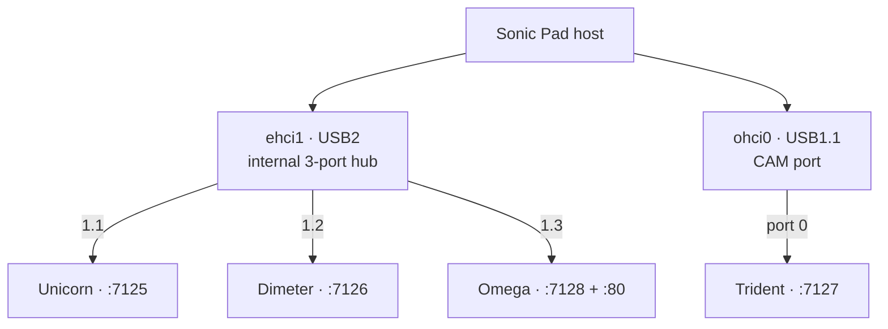
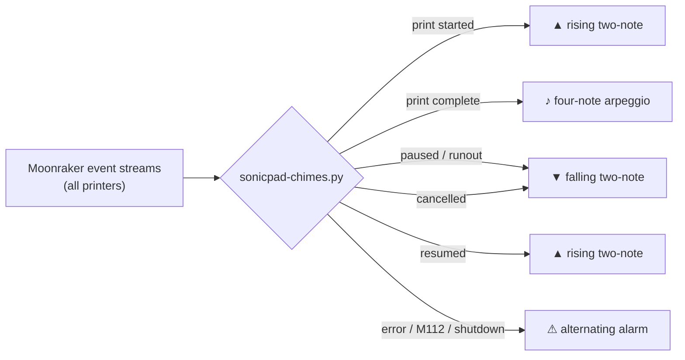
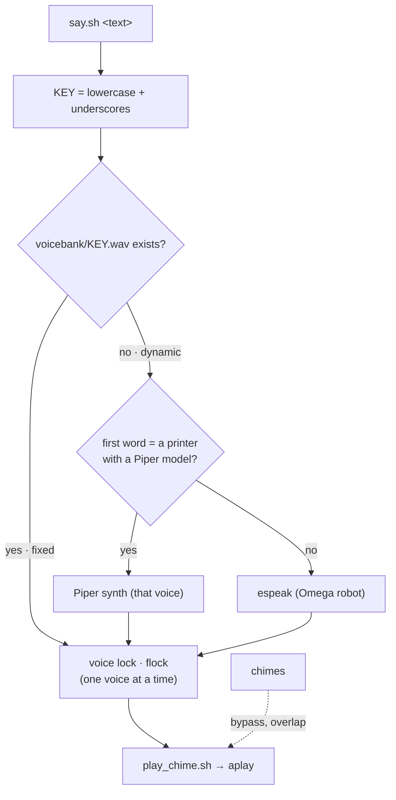

# Turn a dead-end Creality Sonic Pad into a voiced, self-healing print farm

A complete roadmap: wipe the abandoned firmware, run four (or eight) Neptune 3 Pros from one modern portal, tune them properly, back them up automatically — and give the whole rack a voice, lights, and a sense of humor. Every step, every command, and exactly where to run it.

> Built and battle-tested on a four-printer Elegoo Neptune 3 Pro farm (Omega · Unicorn · Dimeter · Trident), prewired for eight (Tesseract · Pentagram · Sestina · Hydra).

**Two phases:** the upgrade (~3–4 hours, sections 3–14) and tuning (~1 hr/printer, section 15, spread over days). You don't need Phase 2 to start printing.

### 📖 How to read this guide — two places you'll type commands

Every command block below is labeled with **where it runs**. Getting this right is the single most common source of confusion:

- **💻 PC · PowerShell** — a PowerShell window on your Windows computer (flashing, file transfers, and *connecting* to the pad).
- **🖥️ Pad · SSH / bash** — the Linux shell *on the pad*. You get there by running `ssh sonic@<pad-ip>` from PowerShell; after that, your terminal **is** the pad until you type `exit`.

When a step moves a file between the two, it's called out explicitly.

## Contents

1. [Why, and what you'll have](#1-why-and-what-youll-have)
2. [What you need + companion files](#2-what-you-need--where-to-get-the-files)
3. [Prep & back up](#3-prep--back-up)
4. [Flash the pad (Windows driver prep)](#4-flash-the-pad-to-debian)
5. [First boot & the power button](#5-first-boot--taming-the-power-button)
6. [Install the four-printer stack (KIAUH)](#6-install-the-four-printer-stack-with-kiauh)
7. [Bind printers to ports — CH340](#7-bind-each-printer-to-a-physical-port--the-ch340-trap)
8. [Board firmware](#8-compile--flash-matching-board-firmware)
9. [Restore configs](#9-restore-configs--three-edits-that-matter)
10. [Fluidd & KlipperScreen](#10-fluidd--klipperscreen)
11. [Shared macros & the LED rig](#11-one-shared-macro-set--the-led-rig)
12. [Sound — the fix, chimes & voice](#12-sound--the-fix-chimes--the-voice-bank)
13. [The four silly shows](#13-the-four-silly-shows)
14. [Automated backups](#14-automated-backups--your-safety-net)
15. [Tune the fleet](#15-phase-2--tune-the-fleet)
16. [Raspberry Pi / tablet host](#16-on-a-raspberry-pi-or-a-tablet-instead)
17. [Updates & upkeep](#17-updates--upkeep)
18. [Troubleshooting & rollback](#18-troubleshooting--rollback)
19. [All links](#19-all-links)

---

## 1. Why, and what you'll have

Creality abandoned the Sonic Pad in early 2024, leaving it on a locked, heavily-modified fork of an old Klipper. This build replaces Creality's OS with **Debian Linux running mainline Klipper, Moonraker, current Fluidd, and KlipperScreen** — the same stack a Raspberry Pi runs — then layers on the quality-of-life and personality features that make a multi-printer farm a joy to run.

| Feature | What you get |
|---|---|
| 🖥️ **One portal** | All machines in one Fluidd page with a switcher and per-printer colors; the pad's touchscreen shows them all. |
| 🔄 **One-click updates** | Klipper, Moonraker, Fluidd update from a button. No more firmware-mismatch dead ends. |
| 🎯 **Real tuning** | Input shaping with the ADXL345 from the pad's box, adaptive mesh, exclude-object, pressure advance. |
| 💾 **Self-healing backups** | Configs, scripts, and voice bank auto-push to a private GitHub repo. Disaster becomes a ~45-min restore. |
| 🗣️ **A voice** | Spoken status, themed chimes for every event (including emergency stop), runout guidance; each printer says its own name. |
| 🎪 **Four one-button shows** | Rangers roll-call, a Space Invaders march, a Newton's cradle, and a Z-axis drag race — motion + LEDs + existing chimes. |

> **🔍 Aside — why replace the OS at all.** On the stock fork, the moment your printer boards' firmware and the pad's Klipper drift a version apart, they refuse to talk (`mcu protocol mismatch`) — and you can't fix a locked fork. Mainline Klipper ends that permanently: the pad **compiles the board firmware itself**, so the two always match.

---

## 2. What you need & where to get the files

| Item | Notes |
|---|---|
| **USB-A ↔ USB-A cable** (male-to-male) | For flashing the pad. **Not in the box** — the #1 reason upgrades stall. Check tonight. |
| A Windows PC | PhoenixSuit is Windows-only; you'll toggle a couple of security settings (section 4). |
| MicroSD card, **8–16 GB**, + reader | For the printer boards. Big/cheap cards are the top cause of failed flashes — use a small, name-brand one. |
| SIM-eject tool / paperclip | To hold the pad's recessed button for flash mode. |
| Masking tape / labels | To label the pad's USB ports and each printer's cable — this *matters* (section 7). |

**Downloads (~1.5 GB, onto your PC):** the three-part [SonicPad-Debian image](https://github.com/Jpe230/SonicPad-Debian/releases) (`.zip` + `.z01` + `.z02` in one folder — extract the `.zip` → `debian_r818_sonic_lcd_uart0.img`); [PhoenixSuit](https://github.com/Jpe230/SonicPad-Debian/tree/main/tools) (with its `Drivers/` folder); and, for insurance, the [stock Creality firmware](https://www.creality.com/pages/download-creality-sonic-pad) for rollback.

**The companion kit** (the voice/lights/shows layer) is cloned later, **on the pad**, in section 11:

**🖥️ Pad · SSH / bash**
```bash
git clone https://github.com/AltaMiraCode/sonic-pad-voiced-farm.git ~/farm-kit
```

It contains `scripts/`, `config/` (macros.cfg, systemd unit, asound.conf), `sounds/` (Default · Doom · Arcade · Zen · Rangers), and `docs/`. No private configs or tokens — those stay on your pad.

> **✅ This is normal — reversible, printers unchanged.** This voids the pad's warranty and is a community project — but full rollback to stock is possible (section 18). Your printers' stock LCD screens stay disconnected exactly as now; nothing about the printers changes.

---

## 3. Prep & back up

> **⚠️ Pitfall — your tuning lives on the pad and gets erased.** z-offsets, PID values, and meshes are stored on the pad and wiped by the reflash. In your **current** Fluidd (before you touch anything), for **each** printer download `printer.cfg` and everything it `[include]`s. Confirm the `SAVE_CONFIG` block at the bottom came along. Also jot down any e-steps/`rotation_distance`, pressure advance, and shaper values.

Note the pad's current IP (Fluidd URL). After the reflash it gets a new IP — plan a **DHCP reservation** in your router afterward.

> **◆ WAYPOINT — Phase 1 begins.**
> **Done:** you have the cable, SD card, downloads on your PC, and a safe copy of every printer's tuned config.
> **Next (sections 4–8):** replace the pad's OS and rebuild the software from a clean base — flash Debian, install a four-printer Klipper stack, then compile and flash matching board firmware.
> **Why this order:** the flash wipes everything, so backups come first; the four-instance stack must exist before printers can be wired to it; and board firmware is compiled *on* the pad so it always matches the Klipper you just installed.

---

## 4. Flash the pad to Debian

The flashing is easy; the friction is entirely Windows refusing the 2013-era driver — so do the driver prep **first**. Everything in this section happens at your PC.

### Step A — prep Windows so it accepts the flash driver

1. **Turn off Memory Integrity.** Windows Security → *Device security* → *Core isolation details* → toggle **Memory integrity OFF** → **reboot**. The setting that most often silently blocks the driver.
2. **Know how to disable driver-signature enforcement** (per-boot, only if A.1 isn't enough): Settings → *System* → *Recovery* → *Advanced startup* → **Restart now** → Troubleshoot → Advanced options → **Startup Settings** → Restart → press **7**. Lasts one boot.
3. **Run `PhoenixSuit.exe` as Administrator**, image already loaded, before putting the pad into flash mode.

### Step B — flash

1. Pad **off**; unplug all printers from it.
2. USB-A↔A cable from your PC to the pad's **CAM** port.
3. PhoenixSuit → **Firmware** tab → **Image** → select the `.img`.
4. Hold the outermost recessed button with a paperclip and, while holding, power the pad on. Screen black, side light on — that's flash (FEL) mode.
5. If Windows shows an unknown device: Device Manager → right-click → **Update driver** → *Browse my computer* → point at `Drivers\AW_Driver` inside PhoenixSuit (**not** `ADB_Driver`).
6. Confirm the flash (full flash if asked) and **don't touch anything for 10+ minutes**. It reboots into Debian when done. ([Upstream flashing docs](https://github.com/Jpe230/SonicPad-Debian/blob/main/docs/flashing.md).)

> **✅ This is normal — the black screen.** During flashing the screen is black with only the side light on. Trust the clock.

> **⚠️ Pitfall — "unknown device VID_1f3a" with a warning (Code 52).** The pad **is** in flash mode but Windows is blocking the driver. In order: (1) Code 52 = signature block; (2) Memory Integrity OFF + reboot; (3) boot with signature enforcement disabled; (4) re-enter FEL with PhoenixSuit already running as Admin; (5) if the driver loads but PhoenixSuit is blind, use a **USB 2.0** port — FEL is flaky on USB 3.

---

## 5. First boot & taming the power button

On the pad's touchscreen, set up **WiFi** and note the IP. Now connect from your PC — this is the moment your terminal crosses from the PC to the pad:

**💻 PC · PowerShell**
```powershell
ssh sonic@<pad-ip>        # default password: sonic
```

You're now at a shell **on the pad**. Everything below runs there:

**🖥️ Pad · SSH / bash**
```bash
passwd                                 # change the default password now
sudo apt update && sudo apt upgrade -y
sudo apt install -y git evtest
sudo timedatectl set-timezone America/New_York
```

Then set the DHCP reservation in your router (from any browser) so the pad keeps this IP.

> **🔍 Aside — why the power button needs taming.** Debian runs a read/write filesystem; cutting power without a clean shutdown can corrupt it. Make a short press = graceful shutdown:
>
> **🖥️ Pad · SSH / bash**
> ```bash
> sudo nano /etc/systemd/logind.conf   # uncomment/set: HandlePowerKey=poweroff
> sudo systemctl restart systemd-logind
> ```
> A multi-second *hold* is a hardware force-off that can't be disabled — but that takes deliberate pinning. Shut down via Fluidd → Power → Host shutdown, then cut power once the screen's dark.

---

## 6. Install the four-printer stack with KIAUH

The image ships one preinstalled Klipper/Moonraker. [KIAUH](https://github.com/dw-0/kiauh) (a menu-driven installer) rebuilds it as four. Run it on the pad, in your SSH session:

**🖥️ Pad · SSH / bash**
```bash
cd ~ && git clone https://github.com/dw-0/kiauh.git
./kiauh/kiauh.sh
```

Work the menus in order:

1. **[Remove]** → remove the preinstalled **Klipper**, then **Moonraker**. Leave KlipperScreen.
2. **[Install] → Klipper** → **4 instances**. If custom names are offered, use `omega unicorn dimeter trident` (lowercase → `printer_omega_data` etc.); if only numbers, use `1`–`4`.
3. **[Install] → Moonraker** → auto-creates four on ports **7125–7128**.
4. **[Install] → Fluidd** → one install serves all four.
5. **Later, when you reach section 12:** **[Install] → Advanced → G-Code Shell Command** — lets macros run shell scripts (needed for the sound-theme buttons). Install it *before* adding any macro that references it.

> **⚠️ Pitfall — skip the Mainsail/client-config macro package.** If KIAUH offers a client-config macro set, **skip it**. Your restored configs already define `PAUSE`/`RESUME`/`CANCEL_PRINT`; installing it on top creates duplicate-macro definitions and Klipper refuses to start.

Each instance owns a folder: `~/printer_1_data/config/` … or `~/printer_OMEGA_data/config/`.

---

## 7. Bind each printer to a physical port — the CH340 trap

> **🔍 Aside — why the usual method fails.** The Neptune 3 Pro talks over a **CH340** USB-serial chip with **no unique serial number**. All four printers look byte-for-byte identical to Linux, so `/dev/serial/by-id/` can't tell them apart. Identify each printer by the **physical port** it's plugged into (`by-path`). The trade-off: a printer must stay on its labeled port — swap ports and you swap identities.

Label the pad's ports and cables. Then, on the pad, plug in **one printer at a time** and record its path:

**🖥️ Pad · SSH / bash**
```bash
ls /dev/serial/by-path/     # e.g. platform-....ehci1-controller-usb-0:1.3:1.0-port0
```



Write down each printer's path — you'll paste it into that printer's `[mcu] serial:` in section 9.

> **✅ This is normal — one path looks different.** Three printers hang off the internal USB2 hub (`...ehci1...`) and one off the separate CAM controller (`...ohci0...`). Expected — different controller.

---

## 8. Compile & flash matching board firmware

Compiling on the pad guarantees the board firmware matches the pad's Klipper exactly. This section moves between the pad (build) and the PC (copy to SD).

### Step A — build it on the pad

**🖥️ Pad · SSH / bash**
```bash
cd ~/klipper
make clean
make menuconfig
```

Set (per the [official Neptune 3 Pro config](https://github.com/Klipper3d/klipper/blob/master/config/printer-elegoo-neptune3-pro-2023.cfg)): Architecture **STM32**, model **STM32F401**, **32KiB bootloader**, communication **Serial (USART1 PA10/PA9)**. Quit & save, then:

**🖥️ Pad · SSH / bash**
```bash
make
cp out/klipper.bin ~/ZNP_ROBIN_NANO.bin
```

### Step B — copy the firmware to your PC

Open a **second** PowerShell window (leave the SSH one open) and pull the file down:

**💻 PC · PowerShell**
```powershell
scp sonic@<pad-ip>:~/ZNP_ROBIN_NANO.bin .
```

### Step C — SD-flash each board (one at a time)

Format the microSD **FAT32**, put **only** `ZNP_ROBIN_NANO.bin` on it. For each printer: printer OFF → card in → power on, wait a full **2 minutes** (no feedback) → power off → move card to the next.

> **⚠️ Pitfall — the `.CUR` rename & the SD card.** After a successful flash the bootloader renames the file to `ZNP_ROBIN_NANO.CUR`, so the *first* printer consumes it. **Re-copy a fresh `.bin` before every board.** If a board won't take the flash: reformat FAT32, try a smaller/name-brand card — an 8 GB card rescues most failures.

> **◆ WAYPOINT — hardware done, software next.**
> **Done:** Debian is on the pad, four Klipper/Moonraker instances exist, each printer is bound to a known USB port, and every board runs firmware that matches the pad.
> **Next (sections 9–10):** hand each instance its printer config and bring the fleet up in one Fluidd portal.
> **Why now:** the instances are empty shells until they get a `printer.cfg` pointing at the right board; once they connect, Fluidd ties them into one dashboard.

---

## 9. Restore configs — three edits that matter

Upload each backed-up `printer.cfg` to its instance folder — easiest via Fluidd's Configuration tab (section 10), or `scp` from your PC. Then make exactly these edits (everything else, including `SAVE_CONFIG`, carries over):

1. **`[mcu] serial`** → that printer's `by-path` value (section 7); add `restart_method: command`.
2. **`[virtual_sdcard] path`** → the instance's own gcodes folder, e.g. `~/printer_1_data/gcodes`.
3. **Delete `DATA_SAVE`** from the `G29` macro — a Creality-fork-only command that doesn't exist in mainline, so any print calling `G29` errors mid-job. Reduce it to `G28` + `BED_MESH_CALIBRATE`.

Restart each instance (Fluidd prompts, or `sudo systemctl restart klipper-<name>` on the pad); confirm each connects. If Klipper rejects a directive, it renamed since your old fork — check [Config Changes](https://www.klipper3d.org/Config_Changes.html).

---

## 10. Fluidd & KlipperScreen

From any browser on your network, open `http://<pad-ip>/`. Click the printer name → **Add printer** → add the others by `ip:port` (`:7125`, `:7126`, `:7127`; the port-80 default is the fourth). Give each its own **theme color**. For the pad's touchscreen, drop a 4-printer `KlipperScreen.conf` in place and restart it:

**🖥️ Pad · SSH / bash**
```bash
sudo systemctl restart KlipperScreen
```

([Fluidd docs](https://docs.fluidd.xyz) · [KlipperScreen theming](https://klipperscreen.readthedocs.io/en/latest/Theming/).)

> **✅ This is normal — Fluidd quirks.** After pasting a printer URL, backspace and retype one character or the validation never fires. And the printer list sorts by its own logic — don't fight it.

> **◆ CHECKPOINT — you have a working farm.**
> **Milestone:** all four printers are on modern mainline Klipper, in one Fluidd portal and on the touchscreen, and can print right now. If you stopped here, you'd already have beaten the abandoned-firmware problem for good.
> **Everything from here is optional polish** — but it's the part that makes this farm *yours*: shared macros, sound, voice, light shows, and automated backups. Then Phase 2 (tuning) for print quality.

---

## 11. One shared macro set & the LED rig

First, get the companion kit onto the pad (you'll use it for the rest of the build):

**🖥️ Pad · SSH / bash**
```bash
git clone https://github.com/AltaMiraCode/sonic-pad-voiced-farm.git ~/farm-kit
```

Put all macro logic in a single `macros.cfg` (`~/farm-kit/config/macros.cfg`) deployed identically to every printer. Copy it into each config folder, add `[include macros.cfg]` at the top of each `printer.cfg`, and delete the now-duplicated `PAUSE`/`RESUME`/`CANCEL_PRINT`/`M420`/`G29` blocks.

Standardize the lights fleet-wide — every printer's `printer.cfg` gets:

**🖥️ Pad · config file**
```ini
[led LED_Light]
white_pin: PB9
initial_white: 1.0
```

with `LIGHTS_ON`/`LIGHTS_OFF`/`LIGHTS_TOGGLE` and a dimmable `_LEDW W=0..1` helper (drives the shows). Then enable object processing for exclude-object + adaptive mesh:

**🖥️ Pad · SSH / bash**
```bash
for P in OMEGA UNICORN DIMETER TRIDENT; do
  grep -q "^\[file_manager\]" ~/printer_${P}_data/config/moonraker.conf \
   || printf '\n[file_manager]\nenable_object_processing: True\n' >> ~/printer_${P}_data/config/moonraker.conf
done
sudo systemctl restart moonraker-OMEGA moonraker-UNICORN moonraker-DIMETER moonraker-TRIDENT
```

> **🔍 Aside — the slicer interface (done on your PC's slicer).** Point every slicer's start G-code at `PRINT_START BED={...} EXTRUDER={...}` (and `PRINT_END`). Passing the temps tells the slicer *not* to inject its own heat-up — `PRINT_START` owns the sequence, so all printers behave identically. [OrcaSlicer](https://github.com/SoftFever/OrcaSlicer) speaks Klipper natively; Cura works too with object processing on.

---

## 12. Sound — the fix, chimes & the voice bank

**The bug we hit — "the speaker is dead."** Out of the gate the pad's speaker seemed silent: `aplay` ran without error but produced nothing, and nudging `alsamixer` did nothing that stuck. It looked like a hardware/driver dead-end.

**The fix — it was never broken.** Two quirks hid a working speaker:

1. The mixer's `digital volume` control is an **inverted attenuator** — **0 = full volume**, high = silence.
2. The BSP audio driver **resets its mixer registers every time a stream opens**, wiping anything set in `alsamixer` the instant you play.

The cure is a wrapper (`play_chime.sh`) that **asserts the full known-good mixer state immediately before every `aplay`** — stronger than a boot-time `alsactl store`:

**🖥️ Pad · inside play_chime.sh**
```bash
amixer -c 0 sset 'digital volume' 0            # ATTENUATOR: 0 = full volume
amixer -c 0 sset 'LINEOUT' on
amixer -c 0 sset 'LINEOUT volume' "$LOUDNESS"  # 0-31, from ~/.volume (31 = max)
amixer -c 0 sset 'LINEOUT Output Select' DAC_SINGLE
amixer -c 0 sset 'Headphone' on
amixer -c 0 sset 'HpSpeaker' on
amixer -c 0 sset 'DAC Swap' Off
exec aplay -q "$W"
```

An `~/asound.conf` (`dmix`, in the repo) lets multiple sounds play at once. Loudness lives in `~/.volume` (0–31). Everything routes through `play_chime.sh`, so it's always right.

With sound working, a daemon watches every printer's Moonraker event stream and plays a sound per event — including **emergency stop / Klipper shutdown**, which no macro can announce (Klipper stops running macros on M112; the daemon hears it from outside).



**Install the chime daemon:**

**🖥️ Pad · SSH / bash**
```bash
cd ~/farm-kit
cp scripts/play_chime.sh scripts/say.sh scripts/set-sound-theme.sh scripts/sonicpad-chimes.py ~
cp -r sounds ~/sounds && ln -sfn ~/sounds/Default ~/chimes
cp config/asound.conf ~ && sudo cp ~/asound.conf /etc/asound.conf
chmod +x ~/play_chime.sh ~/say.sh ~/set-sound-theme.sh ~/sonicpad-chimes.py
sudo apt install -y python3-websockets
~/play_chime.sh ~/chimes/done.wav            # test — loud & consistent
sudo cp config/sonicpad-chimes.service /etc/systemd/system/
sudo systemctl daemon-reload && sudo systemctl enable --now sonicpad-chimes
```

`systemctl status sonicpad-chimes` should show it connected. The port map lives in the `PRINTERS` dict in `sonicpad-chimes.py`.

**Swappable sound themes:** five ship — **Default · Doom · Arcade · Zen · Rangers**. Switch instantly:

**🖥️ Pad · SSH / bash**
```bash
~/set-sound-theme.sh Doom      # run with no argument to list themes
```

For tappable buttons, install `gcode_shell_command` (KIAUH → Advanced) and add the `SOUND_THEME_*` macros from `macros.cfg`.

> **⚠️ Pitfall — install the shell extension first.** Any macro referencing `gcode_shell_command` makes Klipper refuse to start if the extension isn't installed.

**The spoken voice bank:** speech uses [Piper](https://github.com/rhasspy/piper) to **pre-render** every fixed line into `~/voicebank/*.wav`. `setup_voicebank.sh` does it end to end:

**🖥️ Pad · SSH / bash**
```bash
cd ~/farm-kit && cp scripts/render_voicebank.sh scripts/setup_voicebank.sh ~
~/setup_voicebank.sh        # downloads Piper + voices, renders, normalizes
```



> **🔍 Aside — pre-render, then reclaim the space.** Because fixed lines are baked to WAVs, you can **delete the Piper models afterward** (~0.5 GB) and still keep every announcement — only dynamic lines (times, percentages) need a live synth, and one espeak voice (Omega's) covers those. Keep `docs/VOICES.md` — the recipe to re-render later. A farm-wide voice lock plays one voice at a time; chimes overlap freely.

---

## 13. The four silly shows

With dimmable LEDs (`_LEDW`) and the themes in place, the fleet performs. Four one-button macros ship in the kit (`scripts/rangers.sh`, `invaders.sh`, `cradle.sh`, `race.sh`, wired to macros in `macros.cfg`). Each uses motion + light + *existing* theme chimes only:

- **`SILLY_RANGERS` — the Power Rangers morph.** Every idle printer powers up with a full silent home to the Rangers fanfare; then, in fleet order, each printer calls **its own name** as it dances (others fast-flash behind it); a beat of silence; then Omega alone shouts **"GO GO POWER PRINTERS!"** while every head shakes; the boot sting; a silent power-down.
- **`SILLY_INVADERS` — the Space Invaders march.** The fleet advances across the X plane in stepped rows to the Arcade theme's blips, descending like the arcade aliens, with the start sound on each ascending sweep.
- **`SILLY_CRADLE` — the fleet Newton's cradle.** Printers act as beads in desk order; the glow and a Zen gong travel bead-to-bead through two round trips (the far bead swings out, hangs, returns), then the lights breathe and a Zen "done" closes it.
- **`SILLY_RACE` — the Z-axis drag race.** Omega calls "start your engines"; a three-blip countdown; one lap up and back with each racer drawing a secret speed; then the reveal — lights return **ranked** (winner brightest → last dimmest) as the winner names itself and Omega announces the result, then an end chime rings congruent with a flashing finale, and the ranked podium stays lit.

> **🔍 Aside — safe by construction, scales 1→8.** Every show self-daemonizes (the button returns instantly), shares one lock (only one show at a time), and **busy-guards** each printer — a machine that's printing sits the dance out. Casts are built from whatever printers are reachable and idle, so the same macros work with one printer or all eight.

---

## 14. Automated backups — your safety net

Set up [klipper-backup](https://github.com/Staubgeborener/klipper-backup) to auto-push to a free **private** GitHub repo (separate from the public companion repo). Run it on the pad:

**🖥️ Pad · SSH / bash**
```bash
cd ~ && git clone https://github.com/Staubgeborener/klipper-backup.git
./klipper-backup/install.sh          # follow prompts: GitHub account + token
```

> **🔍 Aside — back up the personality, not just the printers.** In `.env`, extend `backupPaths` beyond the config folders to include your home scripts, `voicebank/`, and the sound themes — so a rebuild restores the *whole* system. A daily cron (`0 4 * * *`) keeps it current. Keep the GitHub **token** out of screenshots/logs; if it leaks, revoke it, generate a new one, and update `.env`.

> **◆ WAYPOINT — the build is complete.**
> **Done:** a four-printer farm on mainline Klipper, one portal, a shared macro set, voice + chimes + light shows, and hands-off backups. This is the full "state" of the reference build.
> **Next (section 15):** Phase 2 — tuning — for print *quality*. It's independent of everything above and can wait until you've printed for a day or two.

---

## 15. Phase 2 — tune the fleet

Once all machines print, tune each at your own pace: a mechanical once-over; PID for hotend and bed; extruder `rotation_distance`; z-offset and a fresh mesh; then input shaping with the pad's [ADXL345](https://www.klipper3d.org/Measuring_Resonances.html); then [pressure advance](https://www.klipper3d.org/Pressure_Advance.html); then slicer-side flow/temp/retraction ([Ellis' guide](https://ellis3dp.com/Print-Tuning-Guide/)).

> **🔍 Aside — input shaping, one printer at a time.** Resonance testing needs a "host MCU" service to read the accelerometer, and only one printer can claim it at once. Test sequentially, moving the sensor between machines. Finish by raising each frame's acceleration limits to what it supports. Keep a one-page scorecard of every printer's tuned values side by side.

---

## 16. On a Raspberry Pi or a tablet instead

The Sonic Pad is just a cheap Linux host with a screen. The same farm runs elsewhere — only the first step changes.

**Raspberry Pi.** A Pi is already Linux, so **skip the PhoenixSuit flash and the Debian image entirely**. Flash Raspberry Pi OS Lite (or [MainsailOS](https://docs.mainsail.xyz/setup/mainsail-os)), boot, SSH in — and pick this guide up at **KIAUH (section 6)**. Everything after is identical.

> **🔍 Aside — which Pi, and what's missing.** A Pi 4/5 handles four-plus instances; a Pi Zero 2 W suits one or two. Add an HDMI/DSI **touchscreen** for KlipperScreen and a USB/3.5 mm **speaker** for the voice — the two things the pad includes.

**Can a tablet actually *host* it? Yes — three ways.** Its usual role is the **portal** (any browser → Fluidd, wall-mounted, zero install). But it *can* be the brain (the Sonic Pad itself is proof — it's an Allwinner tablet running Debian). Pick by how much you'll tinker:

1. **Flash mainline Linux (best if supported).** If your tablet's chip is supported by [Armbian](https://www.armbian.com/) or [postmarketOS](https://postmarketos.org/), install it and treat the tablet exactly like the Pi path — real hardware access, KIAUH, the works. Check your exact SoC/model on their device lists first.
2. **Root + a Linux chroot (works on most Android tablets).** Root, then use [Linux Deploy](https://github.com/meefik/linuxdeploy) (or UserLAnd with root) for a full Debian/Ubuntu chroot. Because it's rooted, the chroot can reach the USB-serial printers, so Klipper/Moonraker/Fluidd install and connect via KIAUH inside it.
3. **Termux + proot (no root — easiest to start, but a catch).** [Termux](https://termux.dev/) + `proot-distro` installs a Debian userland in minutes and runs Moonraker + Fluidd. **The catch:** without root, reaching `/dev/ttyUSB*` is the blocker — Klipper can't use Android's `termux-usb` bridge, so it can't actually drive a printer this way. Fine as a remote UI, not a host.

> **⚠️ Pitfall — the two tablet-host realities.** **USB access** is the whole game: hosting needs root (option 2) or mainline Linux (option 1) so Klipper can open the serial device, plus true **USB host mode** and enough power for the boards (a powered hub helps). **KlipperScreen** expects a Linux display server Android doesn't provide — under options 2–3 you'd use Fluidd in the browser instead. Net: for most people, tablet = portal; host only if you'll root/flash it.

---

## 17. Updates & upkeep

- **Software** — Fluidd → Settings → Software Updates, one click per component.
- **Board firmware** — only when a Klipper update changes the MCU protocol (it tells you). Repeat section 8; `menuconfig` remembers your settings (~30 min). A couple times a year at most.
- **OS** — occasional `sudo apt update && sudo apt upgrade` on the pad.
- **Rule of thumb** — never update mid-print, and never the day before you need every printer running.

> **✅ This is normal — "mcu protocol mismatch"** after an update just means the pad and a board drifted a version apart. Reflash that board and it's gone.

---

## 18. Troubleshooting & rollback

| Symptom | Fix |
|---|---|
| PhoenixSuit can't see the pad; `VID_1f3a` warning (Code 52) | Memory Integrity OFF + reboot; boot with signature enforcement off; run PhoenixSuit as Admin; USB 2.0 port; driver from `Drivers\AW_Driver`. |
| A board won't take the SD flash | Reformat FAT32, small name-brand card, single `.bin`, wait 2 min, re-copy a fresh `.bin` (the `.CUR` rename). |
| Speaker silent / `aplay` makes no sound | Not broken — `digital volume` is inverted (0 = loud) and the driver resets the mixer per stream. Route audio through `play_chime.sh` (section 12). |
| Board reports the old MCU version after flashing | The instance cached it — `sudo systemctl restart klipper-<NAME>` and re-check. |
| Klipper won't start after config restore / adding a sound macro | Renamed directive ([Config Changes](https://www.klipper3d.org/Config_Changes.html)), a duplicate macro (client-config trap), or a `gcode_shell_command` macro added before the extension exists. |
| Printers swapped identities | Cables on the wrong ports — match the labels (section 7). |
| Filesystem corrupted (unclean power loss) | Reflash (4) → KIAUH reinstall (6) → restore from GitHub (14). |
| Full rollback to stock | Flash the [official Creality image](https://www.creality.com/pages/download-creality-sonic-pad) like section 4, then reflash boards with stock bins. |

---

## 19. All links

| What | Where |
|---|---|
| Debian image · PhoenixSuit · flashing docs | https://github.com/Jpe230/SonicPad-Debian (/releases · /tree/main/tools · /docs/flashing.md) |
| KIAUH | https://github.com/dw-0/kiauh |
| Neptune 3 Pro Klipper config | https://github.com/Klipper3d/klipper/blob/master/config/printer-elegoo-neptune3-pro-2023.cfg |
| Klipper releases / config changes / resonances / pressure advance | https://www.klipper3d.org/Releases.html · /Config_Changes.html · /Measuring_Resonances.html · /Pressure_Advance.html |
| Fluidd · KlipperScreen | https://docs.fluidd.xyz · https://klipperscreen.readthedocs.io |
| klipper-backup | https://github.com/Staubgeborener/klipper-backup |
| Piper TTS · voices | https://github.com/rhasspy/piper · https://huggingface.co/rhasspy/piper-voices |
| OrcaSlicer · Ellis' tuning guide | https://github.com/SoftFever/OrcaSlicer · https://ellis3dp.com/Print-Tuning-Guide |
| Tablet-as-host: Armbian · postmarketOS · Linux Deploy · Termux | https://armbian.com · https://postmarketos.org · https://github.com/meefik/linuxdeploy · https://termux.dev |
| This build's companion kit | https://github.com/AltaMiraCode/sonic-pad-voiced-farm |

---

*A complete roadmap from a stock Sonic Pad + Neptune 3 Pro to a four-printer voiced farm, prewired for eight. Every fixed announcement is pre-rendered; every config is backed up; every printer knows its own name.*
